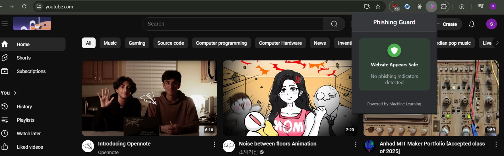
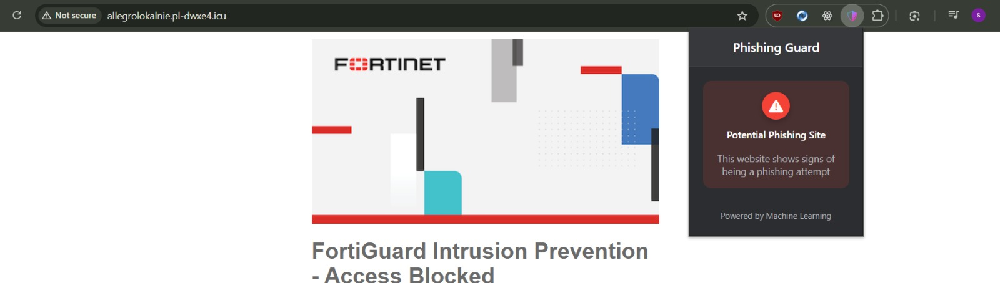

# URL Phishing Guard

## Overview

**URL Phishing Guard** is a machine learning-powered Flask API and Chrome extension designed to detect phishing websites based on extracted URL features. The project consists of two main components:

1. **Flask API**: Analyzes URLs using a pre-trained machine learning model to determine whether a given URL is phishing or legitimate.
2. **Chrome Extension**: Provides a user-friendly interface for users to check URLs in real time directly from their browser.

## Features

- Uses machine learning to analyze URL characteristics.
- Extracts various features, including domain information, URL length, presence of special characters, and metadata.
- Integrates VirusTotal API for enhanced legitimacy checks.
- Supports real-time phishing detection with a probability score.
- Chrome extension for seamless browser integration.

## Repository Structure

```
url_phishing_guard/
│-- chrome_extension/  # Chrome extension files
│-- extract_features.py  # URL feature extraction module
│-- app.py  # Flask API implementation
│-- rf_model.pkl  # Pre-trained Random Forest model
│-- scaler.pkl  # Data scaler for feature normalization
│-- tld_encoder.pkl  # Encoder for TLD categorical feature
│-- requirements.txt  # Required dependencies
│-- README.md  # Project documentation
```

## Outputs






## Installation

### 1. Clone the Repository

```bash
git clone https://github.com/sponge-24/url_phishing_guard.git
cd url_phishing_guard
```

### 2. Install Dependencies

```bash
pip install -r requirements.txt
```

### 3. Set Up Environment Variables

Check for a `.env` file in the root directory and add the VirusTotal API key:

```
api_key=YOUR_VIRUSTOTAL_API_KEY
```

### 4. Run the Flask API

```bash
python app.py
```

The API will start on `http://127.0.0.1:5000`.

## API Usage

### Endpoint: `/check-phishing`

**Method:** POST\
**Request Body:**

```json
{
    "url": "https://example.com"
}
```

**Response:**

```json
{
    "is_phishing": false,
    "probability": 0.23
}
```

## Chrome Extension Setup

1. Open **Google Chrome** and navigate to `chrome://extensions/`.
2. Enable **Developer mode** (top right corner).
3. Click **Load unpacked** and select the `chrome_extension` folder.
4. The extension will now be available in your browser.


